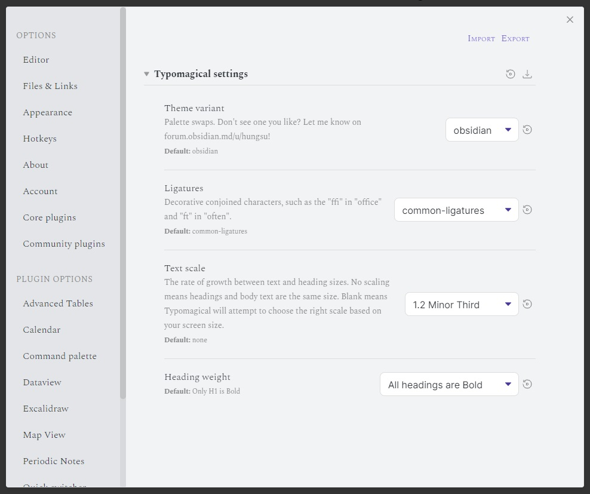

# Typomagical for Obsidian

An Obsidian theme for typographic appreciators, with support for [Style Settings](https://github.com/mgmeyers/obsidian-style-settings) by mgmeyers

> Latest update 3.0.0
> Breaking change - Most font weights removed to comply with developer guidelines to be fully local.

-----

## Features


Magazine style [!QUOTE] callouts.

```
> [!quote] Arthur Schopenhauer
> A constant flow of thoughts expressed by other people can stop and deaden your own thought and your own initiative. #quote
```

- No tacky underlines - we achieve everything with  **bold**, *italic*, [small caps](https://practicaltypography.com/small-caps.html) and ***bold italic***
- Friendly text sizing
	- Responds correctly to the Text size slider in settings to Pinch-to-zoom, and to the Ctrl+ shortcut!
	- Mobile friendly headings - it resizes to small and large screens!
	- For even more, install the Style Settings plugin to tweak the type scaling
- Light/Dark support
- High Contrast mode available for increased accessibility. Install the Style Settings plugin to enable it!
- Bonus themes - By installing the Style Settings plugin, you can choose additional colour schemes including Ficus Ruby and VilePlume!
- Hand crafted CSS - no `!important`, and minimal class use for easy overriding if you like using your own CSS snippets.
- Ligature toggle. Like ligatures? You'll like this theme! Don't like ligatures? Install Style Settings and you can turn them off.




## How to use it

1. Open the Appearance tab in Obsidian
2. Click the Manage button
3. Use this search box to find “Typo”, then click “Use”


### Installing extra font weights

1. Go to the Google Fonts page of the font you want weights for, [Spectral](https://fonts.google.com/specimen/Spectral) or [Alegreya Sans](https://fonts.google.com/specimen/Alegreya+Sans?query=alegreya+sans)
2. Click *Get font* then the *Download All* button. A zip file will download.
3. Extract the zip file. You should see a large number of TrueType Font files, or .TTF files.
4. This step varies based on the operating system you are on.
   1. If you're on Windows or Mac, you can double click a file then click Install in the resulting window that opens.
   2. If you have a Samsung Android phone, you will need to rename the .TTF to .APK, then "install" it like an app.

## Recent changes

- 2.1.0: In source mode, set heading size to be the same as other text. Added a Style Setting to turn this off, under Typomagical Headings > Source mode heading size reset

## Further reading

- [Decisions](./decisions.md) - a list of decisions made, along with reasoning.
- [Contributing](./CONTRIBUTING.md) - If you are a developer and want to submit a change, look here

I work on this theme for myself and for my small but wonderful following of fans 💚 If you would like to support development of this theme, you can give me a tip here:

<a href='https://ko-fi.com/D1D2E9XML' target='_blank'></a>
